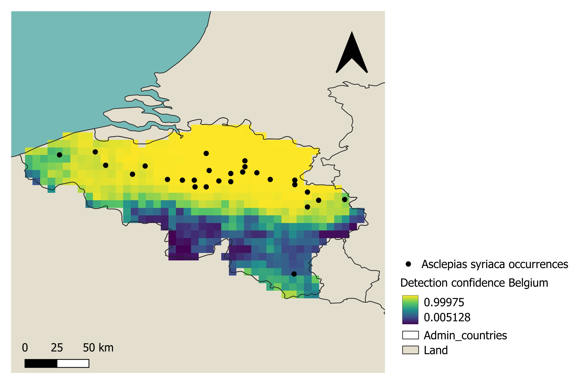

# DetectConf

**Probabilistic confidence surfaces for invasive species GBIF records.**

DetectConf is a prototype R package that estimates how confident we should be in a given GBIF occurrence as a genuine invasive species detection, given the climate plausibility of the location, the local sampling context, the taxonomic composition of nearby recording activity, and the broader invasion context. Rather than predicting where a species could establish, it generates a reliability map of the observation system itself.

The framework was developed for the [2026 GBIF Ebbe Nielsen Challenge](https://www.gbif.org/news/3DyM3tK5wgYipqyaHwG2c2/2026-ebbe-nielsen-challenge-open-for-submissions) and is demonstrated on *Asclepias syriaca* (common milkweed) in Belgium.

<p align="center">
  
</p>

The map above shows the headline output for the demonstration species: every grid (10x10km) cell in Belgium is assigned a detection-confidence score between 0 and 1. High-confidence cells (yellow) are places where, given the local observation system, we would expect *A. syriaca* to have been recorded if it were present. Low-confidence cells (dark blue) are places where apparent absence carries little information — the species may genuinely be absent, or the observation system may simply not have looked closely enough.

---

## What problem is this addressing?

Early detection and interpretation of invasive species records are key challenges in biodiversity monitoring and management. The rapid increase in occurrence data, especially from GBIF and citizen science, has produced more apparent invasion signals. But these records come from observation systems with uneven sampling, observer bias, and delayed data mobilisation, which makes it difficult to determine whether a new occurrence reflects a true biological event or a data artefact. A "first record" may result from a new incursion, a spatial expansion, delayed reporting, or a misidentification — and each carries different management implications.

This ambiguity is increased by a scale mismatch. Invasion status is typically evaluated at the national level, where legal authority and response frameworks are organised. Observation systems, however, operate at regional and local scales, shaped by recorder distribution, taxonomic focus, and temporal activity patterns. Addressing this gap requires methods that can interpret nationally flagged novel records and identify, within the confirmed national invasion front, the areas where new occurrences would actually be reliably detected.

## How DetectConf works

The workflow reframes the central question from *"where can the species establish?"* to *"where would we have seen the species if it were there?"* It does not produce a habitat suitability surface; it produces a spatially explicit assessment of detectability context.

For each grid cell, DetectConf reconstructs the observation process from GBIF metadata alone — without requiring repeated structured surveys or formal estimation of detection probability. The framework quantifies:

- **Sampling intensity** (total records, unique events, recorder counts)
- **Taxonomic composition of recording activity** — what was recorded in each cell, not the recorders' identification skills
- **Temporal structure of effort** (years with records, recording span, recent activity)
- **Observer concentration** (dominance of any single recorder)
- **Spatial corroboration** (density of confirmed presences in the surrounding neighbourhood)
- **Coordinate quality** (mean reported uncertainty)

These cell-level variables are complemented by two external layers: a conservative climate plausibility classification derived from the species' native-range climate envelope (WorldClim via the `geodata` package), and a national-level confirmation prior drawn from the SInAS 3.1.1 alien species database ([Gómez-Suárez et al., 2025](https://doi.org/10.1038/s41597-025-06379-6)).

These sources of evidence are not assumed to contribute independently. Sampling effort is only informative when taxonomically relevant observers are present. Spatial corroboration from neighbouring populations carries different weight under different recording histories. Climate plausibility modulates inference differently in recently active cells than in cells with no recording activity. Because additive models cannot capture these context-dependent interactions and cannot be specified in advance, the model used is **Bayesian Additive Regression Trees** (`dbarts`), which learns meaningful interaction rules directly from the data and reports each cell's detection confidence as a probability distribution rather than a single value.

Pseudo-absences are not drawn from random background locations. They are constrained to the geographic envelope of active invasion fronts, identified through density-based spatial clustering (DBSCAN) of non-native occurrence points. The model therefore learns what distinguishes detected from non-detected locations within the spatial, climatic, and monitoring contexts in which the species could plausibly occur and where the observation system was active.

## Three operational outputs

The detection-confidence surface supports three distinct interpretations:

- **Credible detection** — high confidence and an existing record. Supports the credibility of the occurrence as a genuine detection requiring a rapid response.
- **Monitoring priority** — high confidence, no record, but suitable habitat. Identifies well-monitored cells for periodic reassessment as the invasion front progresses.
- **Surveillance gap** — low confidence within suitable habitat. Identifies places where apparent absence likely reflects limited detectability rather than true absence, and where surveillance investment could be prioritised. This is the output that conventional species distribution models cannot deliver, because they map environmental suitability without assessing whether the underlying data are sufficient to support that inference.

## Performance on the demonstration species

Spatial buffer leave-one-out cross-validation on *Asclepias syriaca* (20 folds, ~150 km buffer):

| Metric            | Mean |
|-------------------|-----:|
| AUC               | 0.985 |
| TSS               | 0.870 |
| Boyce continuous index | 0.965 |
| Type I error      | 0.053 |
| Type II error     | 0.076 |

## Installation

```r
# install.packages("remotes")
remotes::install_github("Evandula/DetectConf-Asclepias_syriaca")
```

DetectConf depends on `data.table`, `terra`, `sf`, `dbarts`, `dbscan`, `rgbif`, `geodata`, `countrycode`, `pROC`, `modEvA`, `matrixStats`, `usdm`, and `fields`. These are installed automatically.

## Quick start

The repository ships with cached artefacts in `inst/extdata/` so you can reproduce the Belgium projection in minutes rather than running the full multi-day pipeline from scratch.

```r
library(DetectConf)
library(terra)

# Load the fitted model and the Belgium projection surface
ext <- function(x) system.file("extdata", x, package = "DetectConf")
bart_model      <- readRDS(ext("bart_model_final.rds"))
belgium_surface <- readRDS(ext("belgium_projection_surface.rds"))

# Predict detection confidence with 95% credible intervals
preds <- dc_predict(bart_model, belgium_surface,
                    quantiles = c(0.025, 0.975), splitby = 5)

belgium_surface[, detect_confidence := preds$pred]
```

For the full demonstration including the three-way output classification and a map, see [`inst/scripts/demo_belgium.R`](inst/scripts/demo_belgium.R).

## Applying DetectConf to a different species or country

The workflow is species-agnostic and transferable to any taxon–country combination with available GBIF data and a native occurrence polygon (e.g., from IUCN). The main steps are:

1. **`dc_climate_envelope()`** — build the classified climate envelope from a native-range polygon
2. **`dc_extract_effort()`** + **`dc_collapse_effort()`** — extract per-cell effort metrics from GBIF downloads
3. **`dc_sinas_prior()`** — derive the national confirmation prior from SInAS
4. **`dc_generate_pseudo_absences()`** — sample pseudo-absences within invasion-front envelopes
5. **`dc_assemble_model_frame()`** — combine into a BART model frame
6. **`dc_fit_model()`** — fit the BART model
7. **`dc_cross_validate()`** — evaluate with spatial buffer cross-validation
8. **`dc_project_country()`** — project to any country at any time window

Taxonomic relevance for non-plant groups is specified via `dc_expertise_config()` (supported: fish, mammal, reptile, anuran, bird, terrestrial vascular plants, bryophytes, terrestrial invertebrates, freshwater invertebrates).

## Repository structure

```
DetectConf/
├── R/                       Function library (12 files)
├── inst/
│   ├── extdata/             Cached artefacts for the Belgium demo
│   └── scripts/
│       └── demo_belgium.R   End-to-end demonstration
├── man/figures/             README figures
├── DESCRIPTION
├── NAMESPACE
└── LICENSE
```

## Citation

If you use DetectConf in your work, please cite the repository and the SInAS dataset it relies on:

> Benavides Rios, E. (2026). *DetectConf: Probabilistic confidence surfaces for invasive species GBIF records.* GitHub repository, https://github.com/Evandula/DetectConf-Asclepias_syriaca

> Gómez-Suárez, M., Laeseke, P., & Seebens, H. (2025). A global dataset of native and alien distributions of alien species. *Scientific Data*, 12, 1914. https://doi.org/10.1038/s41597-025-06379-6

> Seebens, H., & Gómez-Suárez, M. (2025). *SInAS: A global dataset of native and alien distributions of alien species* [Data set]. Zenodo. https://doi.org/10.5281/zenodo.5562891

The demonstration species' native-range polygon is from the IUCN Red List:

> Metzman, H., Preston, J., Williams, M., Kirchner, W., Gerrity, J., Reinier, J. E., Piatt, L., Clark, T., Miller, A., Mikanik, A., Siekkinen, K., Duncan, H., & Dinh, D. (2024). *Asclepias syriaca*. The IUCN Red List of Threatened Species 2024: e.T82359140A82359142. https://dx.doi.org/10.2305/IUCN.UK.2024-1.RLTS.T82359140A82359142.en. Accessed on 21 May 2026.

For the conceptual grounding of treating sampling bias as informative structure rather than noise, see:

> Isaac, N. J. B., & Pocock, M. J. O. (2015). Bias and information in biological records. *Biological Journal of the Linnean Society*, 115, 522–531. https://doi.org/10.1111/bij.12532

## Acknowledgements

DetectConf was developed as a submission to the GBIF Ebbe Nielsen Challenge 2026. The framework draws on GBIF occurrence data, the SInAS alien species database, WorldClim 2 climate variables, and IUCN native-range polygons.

## License

MIT. See [LICENSE](LICENSE) for details.
