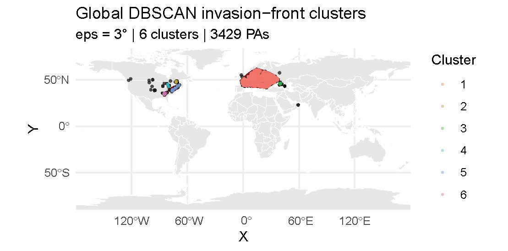

# DetectConf

**A Framework for Interpreting Novel Invasion Signals Using GBIF Data**

DetectConf is a prototype R package that helps interpret new GBIF occurrences of invasive species by estimating, for each location, how reliably the local observation system could have detected the species. Rather than predicting where a species could establish, it produces a reliability map of the observation system itself.

The framework was developed for the [2026 GBIF Ebbe Nielsen Challenge](https://www.gbif.org/news/3DyM3tK5wgYipqyaHwG2c2/2026-ebbe-nielsen-challenge-open-for-submissions) and is demonstrated on *Asclepias syriaca* (common milkweed, native to North America and invasive in parts of Europe) in Belgium.

<p align="center">
  
</p>

The map above shows the headline output for the demonstration species: every grid cell in Belgium is assigned a detection-confidence score between 0 and 1. High-confidence cells (yellow) are places where, given the local observation system, we would expect *A. syriaca* to have been recorded if it were present. Low-confidence cells (dark blue) are places where apparent absence carries little information: the species may genuinely be absent, or the observation system may simply not have looked closely enough.

DetectConf is not a replacement for habitat suitability modelling but a complement to it. A suitability map tells you whether a place could host the species; DetectConf tells you whether the observation system there can be trusted to find it.

---

## What problem is this addressing?

Early detection and interpretation of invasive species records are key challenges in biodiversity monitoring and management. The rapid increase in occurrence data, especially from GBIF and citizen science, has produced more potential signals of new or expanding invasions. But these records often come from observation systems with uneven sampling, observer bias, and delays before records reach public databases ([Isaac & Pocock, 2015](https://doi.org/10.1111/bij.12532)), which makes it difficult to determine whether a new occurrence reflects a true biological event or a data artefact. A "first record" may arise from a new incursion, range expansion, delayed reporting, or misidentification, each requiring a different response, from rapid eradication to standing down a false alarm.

This ambiguity is compounded by a scale mismatch. Invasion status is typically evaluated at the national level, where legal authority and response frameworks are organised. Observation systems (the networks of recorders and institutions producing GBIF data) function, by contrast, at regional and local levels, shaped by recorder distribution, taxonomic focus, and temporal activity patterns. Closing this gap calls for methods that can interpret nationally flagged records and identify, at finer spatial resolution, where a new occurrence would actually be reliably detected.

## How DetectConf works

The workflow reframes a central question in invasion biology from *"where can the species establish?"* to *"where would we have seen the species if it were there?"* For each grid cell, DetectConf reconstructs the observation process from GBIF metadata, without requiring repeated structured surveys or formal estimation of detection probability. The framework quantifies:

- **Sampling intensity** (total records, distinct recording events, unique recorder counts)
- **Taxonomic composition of recording activity**: what was recorded in each cell, not the recorders' identification skills
- **Temporal structure of effort** (years with records, recording span, recent activity flag)
- **Observer dominance** (the proportion of records contributed by the most active recorder)
- **Spatial corroboration** (count of confirmed presence cells within 50 km)
- **Coordinate quality** (mean reported coordinate uncertainty)

These cell-level variables are joined by two external layers at the same resolution: a coarse climate filter built from the species' native-range climate envelope (WorldClim via the `geodata` package), used only to flag where the species' presence is climatically implausible, not as a habitat suitability estimate; and a country-level prior from the SInAS alien species database ([Gómez-Suárez et al., 2025](https://doi.org/10.1038/s41597-025-06379-6)), combining introduction likelihood, establishment status, and the number of independent source datasets supporting each record.

These sources of evidence do not act independently. Sampling effort is only informative when taxonomically relevant observers are present. Spatial corroboration from neighbouring populations carries different weight depending on recording histories. Climate plausibility modulates inference differently in recently active cells than in cells with no recording activity. Because additive models cannot capture these interactions or specify them in advance, the model used is **Bayesian Additive Regression Trees** (`dbarts`), which learns interaction rules directly from the data. Each cell's detection confidence is reported as a probability distribution rather than a single value.

DetectConf extends the ignorance-map tradition ([Rocchini et al., 2011](https://doi.org/10.1177/0309133311399491); [Ruete, 2015](https://doi.org/10.3897/BDJ.3.e5361)), which established the principle of mapping where biodiversity data are reliable rather than only where species occur, into a framework tied to management decisions, with multi-dimensional effort metrics, external knowledge priors, and explicit operational outputs.

Pseudo-absences are not drawn from random background locations. They are restricted to the geographic envelope of active invasion fronts, identified through density-based spatial clustering (DBSCAN) of the focal species' occurrence points in its introduced range. The model therefore learns what separates detected from non-detected locations within the climatically plausible space (defined by the native-range envelope) and where the observation system has been active.

<p align="center">
  
</p>

## Three operational outputs

The detection-confidence surface supports three distinct interpretations:

- **Credible detection**: high confidence and an existing record. Supports the credibility of the occurrence as a genuine detection requiring rapid response.
- **Monitoring priority**: high confidence and no existing record. Identifies well-monitored cells for periodic reassessment as the invasion front advances.
- **Surveillance gap**: low confidence within the projection area. Identifies places where apparent absence likely reflects limited detection rather than true absence, and where surveillance investment could be prioritised.

## Performance on the demonstration species

Spatial buffer cross-validation on *Asclepias syriaca* (9 folds). The buffer radius is determined dynamically as 10% of the species' Minimum Convex Polygon radius, clamped between 100 km and 2000 km, so the buffer scales with range size.
| Metric                  |   Mean |
|-------------------------|-------:|
| AUC                     |  0.947 |
| TSS                     |  0.849 |
| Boyce continuous index  |  0.767 |
| Type I error            |  0.076 |
| Type II error           |  0.074 |

## Workflow architecture

DetectConf is implemented as a modular pipeline of eight functions, each performing one well-defined step, each consuming a data frame and returning a data frame. This stateless data-frame-in / data-frame-out design makes each step independently inspectable, testable, and reproducible.

The eight functions, in dependency order:

1. **`dc_climate_envelope()`**: builds the classified climate envelope from the species' native-range polygon, derived from WorldClim via the `geodata` package.
2. **`dc_extract_effort()`**: the workhorse. For each grid cell, it reconstructs the local observation system from GBIF metadata: total record counts, distinct recording events, unique recorders, taxonomic composition relative to the focal species, temporal structure, observer dominance, and mean reported coordinate uncertainty. Called three times in the pipeline: for presence cells, pseudo-absence cells, and projection-region cells.
3. **`dc_compute_corroboration()`**: computes the spatial corroboration variable (count of confirmed presence cells within 50 km).
4. **`dc_sinas_prior()`**: extracts country-level invasion context from the SInAS alien species database, returning national presence and a confirmation prior combining introduction likelihood, establishment status, and the breadth of supporting evidence.
5. **`dc_generate_pseudo_absences()`**: generates negative examples for model training, restricted to the geographic envelope of active invasion fronts identified by DBSCAN clustering of the focal species' occurrence points in its introduced range.
6. **`dc_assemble_model_frame()`**: joins all sources of evidence into a single model frame ready for fitting.
7. **`dc_fit_model()`**: fits a Bayesian Additive Regression Trees (BART) model. Each cell's detection confidence is returned as a posterior distribution.
8. **`dc_project_country()`**: projects the fitted model onto a target area (a country or any user-defined extent), returning a detection-confidence surface with credible intervals.

### Expertise is taxon-dependent, not rank-dependent

A central design decision in DetectConf is that taxonomic expertise does not operate at a single universal taxonomic rank. Different organism groups are observed, recorded, and identified in different ways, and the taxonomic breadth at which expertise meaningfully affects detectability varies accordingly.

For vertebrates, expertise and sampling practice are often structured at the class level (e.g. fishes, birds, herpetofauna), reflecting distinct survey traditions and observer communities. For plants, formal taxonomic class does not map well onto observer behaviour. Botanists typically operate across multiple classes, and detectability is more strongly driven by morphology, environment, and regional floristic knowledge than by higher-level taxonomy.

DetectConf defines taxon-relevant effort using expertise domains chosen to reflect recording practice rather than formal rank. In the current implementation for terrestrial systems, plant expertise is represented using two broad, observationally coherent groups: terrestrial vascular plants and non-vascular plants (bryophytes).

### Engineering considerations

The pipeline is built around a set of deliberate design decisions, shaped by challenges such as variable harmonisation and circularity, that safeguard against methodological pitfalls in modelling workflows and failures in managing high-volume data.

-**Temporal bins for presence data retrieval.** Several time windows are used to partition GBIF downloads. The bins are deliberately unequal: broad early bins (1800–2005) cover low-volume historical records, while narrower recent bins (2019–2020, 2021–2022) accommodate the exponential growth in GBIF records since 2015. This approach keeps each download at a manageable size.
- **Temporal harmonisation.** Pseudo-absence and projection-area effort data use the same temporal bin structure as the presence-side effort surface, so variables like recording span and recent activity remain directly comparable across the three roles a cell can play in the model.
- **Variable consistency.** Every predictor used by the model is computed with the same code path across the training frame, the prediction frame, and the national projection surface. This prevents mismatches that would corrupt projections.
- **Circularity prevention.** Records of the focal species are removed before computing effort variables, so a cell with 200 *A. syriaca* records is not credited with 200 independent observation events. Observers who recorded the focal species in a given cell are also excluded from that cell's effort count, but remain in other cells where they recorded different taxa.
- **Crash resilience.** Each computationally expensive step writes individual checkpoint files, so the pipeline can resume from any interruption without reprocessing completed steps.
- **Model serialisation.** BART models are saved with `mod$fit$storeState()` before `saveRDS`, preserving the C++ tree state. Without this, a reloaded model returns 0.5 uniformly on predict.

  
### Computational cost

The pipeline is data-intensive in its upstream steps (GBIF taxonomic-group downloads, effort aggregation) and computationally light in its downstream steps (model prediction and projection). Once trained, the model and the country-level projection surface can be cached and re-used, which is why the demonstration on *Asclepias syriaca* in Belgium runs end-to-end in minutes from cached artefacts, even though the full pipeline from raw GBIF data is intensive.

## Installation

```r
# install.packages("remotes")
remotes::install_github("Evandula/DetectConf-Asclepias_syriaca")
```

DetectConf depends on `data.table`, `terra`, `sf`, `dbarts`, `dbscan`, `rgbif`, `geodata`, `countrycode`, `pROC`, `modEvA`, `matrixStats`, `usdm`, and `fields`. These are installed automatically.

## Quick start

The repository ships with cached artefacts in `inst/extdata/` so you can reproduce the Belgium projection in minutes rather than running the full pipeline from scratch.

```r
library(DetectConf)
library(terra)

# Load the fitted model and the Belgium projection surface
ext <- function(x) system.file("extdata", x, package = "DetectConf")
bart_model      <- readRDS(ext("bart_model_final.rds"))
belgium_surface <- readRDS(ext("belgium_projection_surface.rds"))

# Predict detection confidence with 95% credible intervals
preds <- dc_predict(bart_model, belgium_surface,
                    quantiles = c(0.025, 0.975), splitby = 5)

belgium_surface[, detect_confidence := preds$pred]
```

For the full demonstration including the three-way output classification and a map, see [`inst/scripts/demo_belgium.R`](inst/scripts/demo_belgium.R).

## Applying DetectConf to a different species or area

The workflow is species-agnostic and transferable to any taxon and projection area with available GBIF data and a native occurrence polygon (for example, from IUCN). The framework can also be projected onto areas where the species has not yet been recorded, supporting pre-incursion surveillance planning. The main steps follow the workflow architecture above.

Taxonomic relevance for non-plant groups is specified via `dc_expertise_config()` (supported: fish, mammals, reptiles, anurans, birds, terrestrial vascular plants, bryophytes, terrestrial invertebrates, freshwater invertebrates).

## Repository structure

```
DetectConf/
├── R/                       Function library (12 files)
├── inst/
│   ├── extdata/             Cached artefacts for the Belgium demo
│   └── scripts/
│       └── demo_belgium.R   End-to-end demonstration
├── man/figures/             README figures
├── DESCRIPTION
├── NAMESPACE
└── LICENSE
```

## Related work

DetectConf builds on three lines of related work:

- **Ignorance maps** (Rocchini et al., 2011; Ruete, 2015) established the principle of mapping where biodiversity data are reliable, based on sampling effort. DetectConf extends this tradition from descriptive visualisation into a probabilistic framework with multi-dimensional effort metrics, external knowledge priors, and explicit operational outputs.
- **Occupancy-detection modelling** (MacKenzie et al., 2002, and the wider literature) shares the recognition that detection is imperfect and that failing to record a species does not imply absence. DetectConf adopts that principle but does not require repeated structured surveys; it reconstructs the observation process from GBIF metadata alone.
- **Invasive-species reproducible workflows** such as WiSDM (Strubbe et al., 2024) automate risk mapping from open data with confidence visualisation. DetectConf is complementary to these workflows: where WiSDM models habitat suitability and risk, DetectConf models the observation system itself.

## Citation

If you use DetectConf in your work, please cite the repository and the datasets it relies on:

> Benavides Rios, E. (2026). *DetectConf: Probabilistic confidence surfaces for invasive species GBIF records.* GitHub repository, https://github.com/Evandula/DetectConf-Asclepias_syriaca

> Gómez-Suárez, M., Laeseke, P., & Seebens, H. (2025). A global dataset of native and alien distributions of alien species. *Scientific Data*, 12, 1914. https://doi.org/10.1038/s41597-025-06379-6

> Seebens, H., & Gómez-Suárez, M. (2025). *SInAS: A global dataset of native and alien distributions of alien species* [Data set]. Zenodo. https://doi.org/10.5281/zenodo.5562891

The demonstration species' native-range polygon is from the IUCN Red List:

> Metzman, H., Preston, J., Williams, M., Kirchner, W., Gerrity, J., Reinier, J. E., Piatt, L., Clark, T., Miller, A., Mikanik, A., Siekkinen, K., Duncan, H., & Dinh, D. (2024). *Asclepias syriaca*. The IUCN Red List of Threatened Species 2024: e.T82359140A82359142. https://dx.doi.org/10.2305/IUCN.UK.2024-1.RLTS.T82359140A82359142.en. Accessed on 21 May 2026.

For the conceptual grounding of treating sampling bias as informative structure rather than noise:

> Isaac, N. J. B., & Pocock, M. J. O. (2015). Bias and information in biological records. *Biological Journal of the Linnean Society*, 115, 522–531. https://doi.org/10.1111/bij.12532

For the ignorance-map lineage:

> Rocchini, D., Hortal, J., Lengyel, S., Lobo, J. M., Jiménez-Valverde, A., Ricotta, C., Bacaro, G., & Chiarucci, A. (2011). Accounting for uncertainty when mapping species distributions: The need for maps of ignorance. *Progress in Physical Geography*, 35(2), 211–226. https://doi.org/10.1177/0309133311399491

> Ruete, A. (2015). Displaying bias in sampling effort of data accessed from biodiversity databases using ignorance maps. *Biodiversity Data Journal*, 3, e5361. https://doi.org/10.3897/BDJ.3.e5361

## Acknowledgements

DetectConf was developed as a submission to the GBIF Ebbe Nielsen Challenge 2026. The framework draws on GBIF occurrence data, the SInAS alien species database, WorldClim 2 climate variables, and IUCN native-range polygons.

## License

MIT. See [LICENSE](LICENSE) for details.
